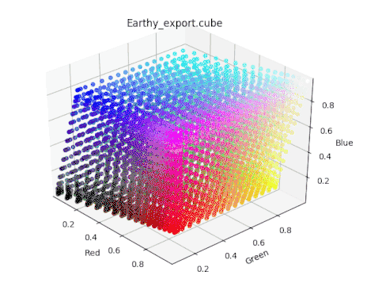
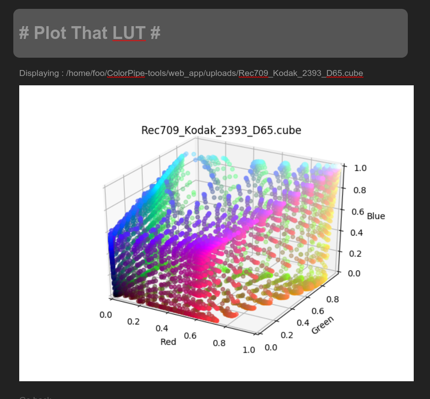

Fork of https://github.com/mikrosimage/ColorPipe-tools that makes it work with
Python3 and fixes minor issues.

NOTE: This fork is neither under active development not actively maintained

ColorPipe-tools
===============

Tools for Color Pipelines.

See [documentation site](http://mikrosimage.github.io/ColorPipe-tools/about/).

Tools overview
---------------

### Plot That LUT
[plotThatLUT](https://github.com/mikrosimage/ColorPipe-tools/tree/master/plotThatLut) is a python script for plotting look up tables based on [OpenColorIO](http://opencolorio.org/) and [matplotlib](http://matplotlib.org/).

### LUT Lab
[lutLab](https://github.com/mikrosimage/ColorPipe-tools/tree/master/lutLab) contains utility python scripts to convert and manipulate Look Up Tables.

Available scripts :   

**lut_to_lut**: convert a 1D/2D/3D LUT into another format.   

**curve_to_lut**: export a LUT from a colorspace gradation function

**rgb_to_xyz_matrix**: generate RGB colorspace to XYZ conversion matrix     

**plot_that_chroma**: plot chromaticity coordinates.

### Web app
[web_app](https://github.com/mikrosimage/ColorPipe-tools/tree/master/web_app) is a web version of the previous tools based on [cherryPy](http://www.cherrypy.org/).

Requirements
-------------------

+ OpenColorIO / PyOpenColorIO (tested versions: 1.1.1) 
+ Numpy (tested versions: 1.18.1) 
+ Scipy (tested versions: 1.3.3) 
+ Argparse
+ Clint (optional)

#### For plot tools
+ Matplotlib

#### For web app
+ cherryPy 
